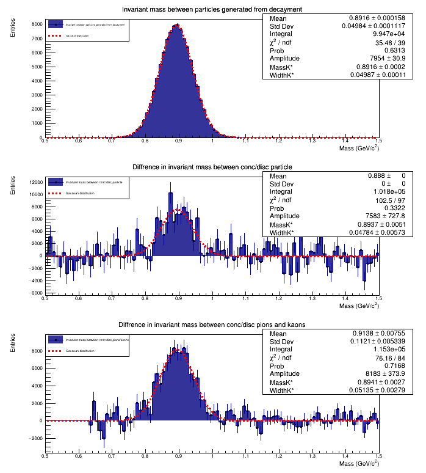

# Particle Generation
This project simulates the results of collisions in high-energy physics. The particles/antiparticles produced in such collisions and generated useing Monte Carlo method are the following:
* Positive and negative pions (π+, π-) 80%
* Kaons and antikaons (K+, K-) 10%
* Protons and antiprotons (p+, p-) 9%
* A kaon resonance (K*)  1%

The percentage next to the particles represents the probability with which they are generated.
The resonance is a short-lived state that immediately decays into other particles. As a consequence we can only observe it by reconstructing the invariant mass of its decay products. The K* decays
into the couples π+K- and π-K+ with a 50% probability. The other particles/antiparticles are stable.

---

## Generation
The number of events considered is 10 5, and for each event 100 particles are generated. For each particle the following quantities are generated:
* Azimuthal angle θ in a range [0,2π] according to a uniform distribution;
* Polar angle φ in a range [0,π] according to a uniform distribution;
* Momentum p according to a negative exponential distribution with mean=1;

## Results

We have three ways to observe the K* as a peak in the invariant mass:

### Invariant mass of the decay products

Since  K* decays in pairs of π+K- and π-K+, the most direct way we can observe it is by renconstructing the invariant mass of its decay products.

### Difference between the invariant masses of particles with concordant and discordant charges

The invariant mass obtained from particles with concordant charges is not related to the K\* in any way since K\* only decays into pair of kaon/pion with discorcant charges. On the other hand when we consider combinations of particles with discordant charges some of them are the result of the K\* decay and others are not. As a consequence by subtructing these invariant masses we get the K\* .

### Difference between the invariant masses of Kaons and Pions with concordant and discordant charges

This method is the same as the one before, but in this case we are only considering Kaons and Pions, reducing the rumour.

The peak in these graph represents the mass of the K\*, whereas the standard deviation represents half the decay width.

